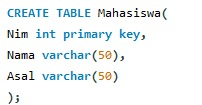

# BAB I BASIS DATA

## Pengenalan Basis Data

::: {style="text-align: justify;"}
Basis data adalah kumpulan data yang saling berhubungan secara logis dan
didesain untuk mendapatkan data yang dibutuhkan oleh suatu organisasi
(Indrajani, 2015).

Basis data (database) adalah sebuah kumpulan informasi yang disimpan di
dalam komputer dan dapat diperiksa, diolah, atau dimanipulasi secara
sistematis menggunakan program komputer. Istilah ***"basis"*** mengacu
pada gudang atau tempat penyimpanan, sedangkan ***"data"*** merujuk pada
fakta-fakta yang dikumpulkan. Dengan menggunakan basis data, pengguna
dapat menyimpan informasi dalam media lain dan mengaksesnya kembali
ketika diperlukan.
:::

## Komponen Basis Data

Komponen-komponen dari basis data terdiri dari:

::: {style="text-align: justify;"}
1.  **Perangkat keras *(Hardware***) **:** Merupakan komponen fisik yang
    terdiri dari komputer, server, penyimpanan data, dan perangkat keras
    lainnya yang digunakan untuk menyimpan dan mengakses basis data.

2.  **Sistem Operasi *(Operating System)*** **:** Merupakan perangkat
    lunak yang mengelola sumber daya perangkat keras dan menyediakan
    lingkungan yang diperlukan untuk menjalankan basis data.

3.  **Basis Data** ***(Database)*** **:** Merupakan kumpulan data yang
    tersimpan di dalam komputer dan terorganisir dalam suatu struktur
    tertentu, seperti tabel, relasi, atau objek, untuk memudahkan
    pengaksesan dan pengelolaan data.

4.  **Sistem Manajemen Basis Data (DBMS):** Merupakan perangkat lunak
    yang digunakan untuk mengelola, mengatur, dan mengontrol basis data.
    DBMS menyediakan antarmuka yang memungkinkan pengguna untuk
    berinteraksi dengan basis data, melakukan operasi seperti
    penyimpanan, pengambilan, pembaruan, dan penghapusan data.

5.  **Pengguna *(User)*:** Merupakan individu atau entitas yang
    menggunakan basis data. Pengguna dapat memiliki peran yang berbeda,
    seperti pengguna akhir yang menggunakan aplikasi untuk mengakses dan
    memanipulasi data, atau administrator basis data yang bertanggung
    jawab untuk mengatur dan mengelola basis data.

6.  **Aplikasi:** Merupakan perangkat lunak lain yang digunakan bersama
    dengan basis data untuk menyediakan fungsionalitas tambahan.
    Aplikasi ini dapat berupa program khusus yang dibangun untuk
    keperluan tertentu atau aplikasi umum yang menggunakan basis data
    sebagai sumber data mereka.
:::

# BAB II MySQL

## Pengenalan

::: {style="text-align: justify;"}
MySQL diciptakan oleh seorang programer asal Swedia yang bernama
**Michael "Monty" Widenius** pada tahun 1995.

MySQL adalah salah satu **Relational Database Management System
(RDBMS)** yang menggunakan bahasa pemrograman **SQL (Structured Query
Language)** sebagai bahasa standarnya dan bersifat **open sources**
dengan dua bentuk lisensi, yaitu **free software** (bebas diakses secara
gratis) dan **shareware** (penggunanya terbatas). Lisensi MySQL yang
biasa kita gunakan adalah MySQL free software yang memiliki lisensi
**GNU (General Public Licence)**, sehingga dapat digunakan untuk
keperluan pribadi ataupun untuk komersial secara gratis. MySQL biasa
digunakan untuk menyimpan berbagai data dalam database yang data-datanya
dapat dimanipulasi sesuai keperluan. Manipulasi data tersebut berupa
menambah, mengubah dan menghapus data yang berada di dalam database.
:::

## Kelebihan

::: {style="text-align: justify;"}
Database MySQL memiliki beberapa kelebihan dibandingkan dengan database
lainnya, yaitu:

1.  **Open Source :** MySQL bersifat gratis dan dapat digunakan oleh
    siapa saja.

2.  **Mendukung bahasa pemrograman lain :** MySQL bisa melakukan
    integrasi dengan bahasa pemrograman lain seperti R, Phyton, PHP,
    JavaScript dll.

3.  **Tidak membutuhkan RAM yang besar :** MySQL dapat digunakan pada
    spesifikasi hardware yang rendah.

4.  **Multi-user :** MySQL dapat digunakan secara bersamaan oleh
    beberapa user.

5.  **Keamanan :** MySQL memiliki sistem keamanan yang baik dengan lebih
    dari satu lapisan keamanan.

6.  **Mendukung berbagai macam data :** MySQLmendukung berbagai macam
    data, mulai dari integer, timestamp, text, date, character, float
    dll.

7.  **Struktur tabel fleksibel :** MySQL memiliki struktur tabel yang
    mudah dipakai dan fleksibel.
:::

## Kekurangan

::: {style="text-align: justify;"}
Seperti software pada umumnya, MySQL juga memiliki beberapa kekurangan,
yaitu:

1.  **Kurang mampu untuk mengelola database dalam jumlah besar :** MySQL
    dikembangkan untuk ramah dengan perangkat yang memiliki spesifikasi
    rendah.

2.  **Kurang cocok untuk aplikasi game dan mobile :** Kebanyakan
    pengembang game maupun aplikasi mobile tidak menggunakan MySQL
    karena database ini masih kurang bagus untuk mengembangkan sistem
    aplikasi tersebut.

3.  **Kurang bagus dari segi technical support :** MySQL tidak memiliki
    technical support untuk komunitas, sedangkan pengguna *Enterprise*
    tersedia technical support dan berbayar.
:::

## Fungsi-fungsi

::: {style="text-align: justify;"}
### Membuat dan memasukkan data pada tabel

1.  **Create Database** : Digunakan untuk membuat database baru

```{r, echo=FALSE}
library(RMySQL)
basis<- dbConnect(RMySQL::MySQL(),
                 user = "root",
                 password = "138910",
                 port = 3307,
                 dbname = "basis",
                 host = "localhost")

# Cek daftar tabel dalam database
tabel <- dbListTables(basis)
print(tabel)

# Memeriksa database yang sedang aktif
dbGetQuery(basis, "SELECT DATABASE();")

```

```{r, echo=TRUE}
library(DBI)
library(RMySQL)

#MEMBUAT DATABASE BARU
dbExecute(basis, "CREATE DATABASE IF NOT EXISTS `be19`")

#MENGGUNAKAN DATABASE BARU
dbExecute(basis,"USE `be19`")
```

2.  **Create Table** : Digunakan untuk membuat tabel data baru dalam
    sebuah database.

```{r, echo=TRUE}
#MEMBUAT TABEL MAHASISWA
dbExecute(basis, "
  CREATE TABLE Mahasiswa (
    id INT AUTO_INCREMENT PRIMARY KEY,
    nama VARCHAR(100),
    asal VARCHAR(100)
  )
")

#MEMBUAT TABEL JURUSAN
dbExecute(basis, "
CREATE TABLE jurusan (
    id INT AUTO_INCREMENT PRIMARY KEY,
    nama_jurusan VARCHAR(100)
)
")
```

3.  **Insert Into** : Digunakan untuk menambahkan data baru di tabel
    database.

<<<<<<< HEAD
```{r, echo=TRUE}
#MEMASUKAN DATA KE DALAM TABEL
tbl_mhs_nw <- "
INSERT INTO Mahasiswa (id, nama, asal)
VALUES (1001, 'Asep','Serang'),
VALUES (1002, 'Beben', 'Serang'),
VALUES (1003, 'Chintia', 'Cilegon'),
VALUES (1004, 'Dadang', 'Tangerang'),
VALUES (1005, 'Edi', null),
VALUES (1006, 'Feby', 'Pandeglang'),
VALUES (1007, 'Gempita', null),
VALUES (1008, 'Helga', 'Cilegon');
"
print(tbl_mhs_nw)
=======
    
>>>>>>> 83d978c3739727a823875a146d9113b1d8c88789

#MEMASUKAN DATA KE DALAM TABEL
tbl_jrs_nw <- "
INSERT INTO jurusan (id, nama_jurusan)
VALUES (1001, 'Teknik Mesin'),
VALUES (1002, 'Administrasi Publik'),
VALUES (1003, 'Statistika'),
VALUES (1004, 'Statistika'),
VALUES (1005,  null),
VALUES (1006, 'Peternakan'),
VALUES (1007,  null),
VALUES (1008, 'Informatika');
"
print(tbl_jrs_nw)
```

4.  **Select** : Digunakan untuk memilih table dari database.

```{r echo=TRUE, message=FALSE}
library(DBI)
library(RMySQL)

#MELIHAT TABEL DALAM DATABASE
tabel<- dbListTables(basis)
print(tabel)

#MELIHAT TABEL
df_mhs <- dbGetQuery(basis, "SELECT * FROM Mahasiswa")
print(df_mhs)

df_jrs <- dbGetQuery(basis, "SELECT * FROM jurusan")
print(df_jrs)
```

5.  **Update** : Digunakan untuk mengubah/memperbarui data di tabel
    database.

```{r, echo=TRUE}
#MENGUPDATE DATA PADA TABEL
query1 <- "
UPDATE Mahasiswa
SET asal = 'Lebak'
WHERE id IN (1005, 1007);
"
print(query1)

query2 <- "
UPDATE jurusan
SET nama_jurusan = 'Psikolog'
WHERE id IN (1005, 1007);
"
print(query2)
```

6.  **Where** : Digunakan untuk memfilter data pada perintah Select

```{r, echo=TRUE}
#MENGUPDATE DATA PADA TABEL
query3 <- "
UPDATE Mahasiswa
SET asal = 'Lebak'
WHERE id IN (1005, 1007);
"
print(query3)

query4 <- "
UPDATE jurusan
SET nama_jurusan = 'Psikolog'
WHERE id IN (1005, 1007);
"
print(query4)
```

### Mengurutkan Data

1.  **ORDER BY**: Menentukan kolom yang menjadi dasar pengurutan.

2.  **ASC**: Untuk pengurutan menaik (ascending). Ini adalah pengurutan
    default, dapat diabaikan jika ingin menaik.

3.  **DESC**: Untuk pengurutan menurun (descending)

```{r, echo=TRUE}
#MENGURUTKAN DATA
#ASC
nama_asc<- "SELECT * FROM Mahasiswa ORDER BY nama ASC"
print(nama_asc)

jurusan_asc<- "SELECT * FROM jurusan ORDER BY nama_jurusan ASC"
print(jurusan_asc)

#DESC
nama_desc<- "SELECT * FROM Mahasiswa ORDER BY nama DESC"
print(nama_desc)

jurusan_desc<- "SELECT * FROM jurusan ORDER BY nama DESC"
print(jurusan_desc)
```

### Menggabungkan tabel

<<<<<<< HEAD
1.  **INNER JOIN** adalah jenis join dalam SQL yang digunakan untuk
=======
    

    JOIN: Kata kunci untuk menggabungkan tabel. ON: Menentukan kondisi
    penggabungan, yaitu kolom yang menghubungkan kedua tabel

2.  Inner Join

    INNER JOIN adalah jenis join dalam SQL yang digunakan untuk
>>>>>>> 83d978c3739727a823875a146d9113b1d8c88789
    menggabungkan data dari dua tabel berdasarkan kecocokan di antara
    kolom yang terkait. INNER JOIN hanya akan menampilkan baris-baris
    yang memiliki kecocokan di kedua tabel; baris yang tidak memiliki
    pasangan di tabel lain tidak akan ditampilkan

```{r, echo=TRUE}
query_inner <- "
SELECT Mahasiswa.id, Mahasiswa.nama, jurusan.nama_jurusan
FROM Mahasiswa
INNER JOIN jurusan
ON Mahasiswa.id_jurusan = jurusan.id;
"
mahasiswa_struct <- dbGetQuery(basis, "DESCRIBE Mahasiswa")
print(mahasiswa_struct)
```

2.  **LEFT JOIN (atau LEFT OUTER JOIN)** adalah jenis join dalam SQL
    yang digunakan untuk menggabungkan data dari dua tabel. LEFT JOIN
    akan mengembalikan semua baris dari tabel kiri (tabel pertama) dan
    hanya baris yang cocok dari tabel kanan (tabel kedua). Jika tidak
    ada kecocokan, kolom dari tabel kanan akan diisi dengan nilai NULL.

```{r, echo=TRUE}
query_left <- "
SELECT Mahasiswa.id, Mahasiswa.nama, jurusan.nama_jurusan
FROM Mahasiswa
LEFT JOIN jurusan
ON Mahasiswa.id = jurusan.id;
"

# Eksekusi query
result_left <- dbGetQuery(basis, "DESCRIBE Mahasiswa")
print(result_left)
```

3.  **RIGHT JOIN (atau RIGHT OUTER JOIN)** adalah jenis join dalam SQL
    yang mengembalikan semua baris dari tabel kanan (tabel kedua) dan
    hanya baris yang cocok dari tabel kiri (tabel pertama). Jika tidak
    ada kecocokan, kolom dari tabel kiri akan diisi dengan nilai NULL.

```{r, echo=TRUE}
query5 <- "
SELECT Mahasiswa.id, Mahasiswa.nama, jurusan.nama_jurusan
FROM Mahasiswa
RIGHT JOIN jurusan
ON Mahasiswa.id = jurusan.id;
"

# Eksekusi query
result_right <- dbGetQuery(basis, "DESCRIBE Mahasiswa")
print(result_right)
```

4.  **FULL OUTER JOIN** adalah jenis join dalam SQL yang mengembalikan
    semua baris dari kedua tabel, baik yang memiliki kecocokan maupun
    yang tidak.

```{r, echo=TRUE}
query_full_outer <- "
SELECT Mahasiswa.id, Mahasiswa.nama, jurusan.nama_jurusan
FROM Mahasiswa
LEFT JOIN jurusan
ON Mahasiswa.id = jurusan.id
UNION
SELECT Mahasiswa.id, Mahasiswa.nama, jurusan.nama_jurusan
FROM Mahasiswa
RIGHT JOIN jurusan
ON Mahasiswa.id = jurusan.id;
"
result_full_outer <- dbGetQuery(basis, "DESCRIBE Mahasiswa")
print(result_full_outer)
```

```         
**UNION** menggabungkan hasil dari LEFT JOIN dan RIGHT JOIN untuk
menghasilkan efek seperti FULL OUTER JOIN. Union Digunakan untuk
menggabungkan hasil dari 2 atau lebih perintah Select.
```
:::

## Tipe Data

::: {style="text-align: justify;"}
Tipe data adalah suatu bentuk pemodelan data yang dideklarasikan pada
saat melakukan pembuatan tabel. Tipe data akan mempengaruhi setiap data
yang akan dimasukkan ke dalam tabel, data yang dimasukkan harus sesuai
dengan tipe data yang dideklarasikan. di MySQL ada beberapa tipe data,
yaitu:

1.  **Tipe Data untuk Bilangan (Number)**

| Type Data |                                                                                        Keterangan                                                                                        |
|:----------:|:----------------------------------------------------------:|
|  TINYINT  |        Ukuran 1 byte. Bilangan bulat terkecil, dengan jangkauan untuk bilangan bertanda: -128 s/d 127 dan untuk yang tidak bertanda : 0 s/d 255. Bilangan tak bertandai dengan ka        |
|           |                                                                                                                                                                                          |
| SMALLINT  |                          Ukuran 2 Byte. Bilangan bulat dengan jangkauan untuk bilangan bertanda : -32768 s/d 32767 dan untuk yang tidak bertanda : 0 s/d 65535                           |
|           |                                                                                                                                                                                          |
| MEDIUMINT |                       Ukuran 3 byte. Bilangan bulat dengan jangkauan untuk bilangan bertanda : -8388608 s/d 8388607 dan untuk yang tidak bertanda : 0 s/d 16777215                       |
|           |                                                                                                                                                                                          |
|    INT    |                   Ukuran 4 byte. Bilangan bulat dengan jangkauan untuk bilangan bertanda : -2147483648 s/d 2147483647 dan untuk yang tidak bertanda : 0 s/d 4294967295                   |
|           |                                                                                                                                                                                          |
|  INTEGER  |                                                                             Ukuran 4 byte. Sinonim dari int                                                                              |
|  BIGINT   | Ukuran 8 byte. Bilangan bulat terbesar dengan jangkauan untuk bilangan bertanda : -9223372036854775808 s/d 9223372036854775807 dan untuk yang tidak bertanda : 0 s/d 1844674473709551615 |

```         
                              
```
| Type Data | Keterangan |
|:---------:|:----------:|
|      FLOAT | Ukuran 4 byte. Bilangan pecahan |
|     DOUBLE | Ukuran 8 byte. Bilangan pecahan |
| DOUBLEPRECISION | Ukuran 8 byte. Bilangan pecahan |
|      REAL | Ukuran 8 byte. Sinonim dari DOUBLE |
|  DECIMAL (M,D) | Ukuran M byte. Bilangan pecahan, misalnya DECIMAL(5,2 dapat digunakan untuk menyimpan bilangan -99,99 s/d 99,99 |
|  NUMERIC (M,D) | Ukuran M byte. Sinonim dari DECIMAL, misalnya NUMERIC(5,2) dapat digunakan untuk menyimpan bilangan -99,99 s/d 99,99 |

<<<<<<< HEAD
|    Type Data    |                                                      Keterangan                                                      |
|:------------:|:-------------------------------------------------------:|
|      FLOAT      |                                           Ukuran 4 byte. Bilangan pecahan                                            |
|     DOUBLE      |                                           Ukuran 8 byte. Bilangan pecahan                                            |
| DOUBLEPRECISION |                                           Ukuran 8 byte. Bilangan pecahan                                            |
|      REAL       |                                          Ukuran 8 byte. Sinonim dari DOUBLE                                          |
|  DECIMAL (M,D)  |   Ukuran M byte. Bilangan pecahan, misalnya DECIMAL(5,2 dapat digunakan untuk menyimpan bilangan -99,99 s/d 99,99    |
|  NUMERIC (M,D)  | Ukuran M byte. Sinonim dari DECIMAL, misalnya NUMERIC(5,2) dapat digunakan untuk menyimpan bilangan -99,99 s/d 99,99 |
=======
>>>>>>> 83d978c3739727a823875a146d9113b1d8c88789

2.  **Tipe Data untuk Tanggal dan Jam**

| Type Data |                                                   Keterangan                                                    |
|:-----------:|:---------------------------------------------------------:|
| DATETIME  | Ukuran 8 byte. Kombinasi tanggal dan jam, dengan jangkauan dari '1000-01-01 00:00:00' s/d '9999-12-31 23:59:59' |
|           |                                                                                                                 |
|   DATE    |                   Ukuran 3 Byte. Tanggal dengan jangkauan dari '1000-01-01' s/d '9999-12-31'                    |
| TIMESTAMP |        Ukuran 4 byte. Kombinasi tanggal dan jam, dengan jangkauan dari '1970-01-01 00:00:00' s/d '2037'         |
|           |                                                                                                                 |
|   TIME    |                     Ukuran 3 byte. Waktu dengan jangkauan dari '839:59:59' s/d '838:59:59'                      |
|   YEAR    |                                 Ukuran 1 byte. Data tahun antara 1901 s/d 2155                                  |

<<<<<<< HEAD
3.  **Tipe Data untuk Karakter**
=======

3.  Tipe Data untuk Karakter
>>>>>>> 83d978c3739727a823875a146d9113b1d8c88789

|              Type Data               |                                                                  Keterangan                                                                   |
|:---------------:|:-----------------------------------------------------:|
|                 CHAR                 |         Mampu menangani data hingga 255 karakter. Tipe data CHAR mengharuskan untuk memasukkan data yang telah ditentukan oleh kita.          |
|                                      |                                                                                                                                               |
|               VARCHAR                |     Mampu menangani data hingga 255 karakter. Tipe data VARCHAR tidak mengharuskan untuk memasukkan data yang telah ditentukan oleh kita.     |
|                                      |                                                                                                                                               |
|          TINYBLOB, TINYTEXT          |                                           Ukuran 255 byte. Mampu menangani data sampai 2\^8-1 data.                                           |
|              BLOB, TEXT              |                             Ukuran 65535 byte. Type string yang mampu menangani data hingga 2\^16-1 (16M-1) data.                             |
|                                      |                                                                                                                                               |
|        MEDIUMBLOB, MEDIUMTEXT        |                                    Ukuran 16777215 byte. Mampu menyimpan data hingga 2\^24-1 (16M-1)data.                                     |
|          LONGBLOB, LONGTEXT          | Ukuran 4294967295 byte. Mampu menyimpan data hingga berukuran GIGA BYTE. Tipe data ini memiliki batas penyimpanan hingga 2\^32-1 (4G-1) data. |
|                                      |                                                                                                                                               |
| ENUM('nilai1','nilai2',...,'nilaiN') |                               Ukuran 1 atau 2 byte. Tergantung jumlah nilai enumerasinya (maksimum 65535 nilai)                               |
|                                      |                                                                                                                                               |
| SET('nilai1','nilai2',...,'nilaiN')  |                                 1,2,3,4 atau 8 byte, tergantung jumlah anggota himpunan (maksimum 64 anggota)                                 |
|                                      |                                                                                                                                               |
:::

# BAB III : Data Base Management System (DBMS)

## Pengenalan

::: {style="text-align: justify;"}
**Database Management System (DBMS)** adalah perangkat lunak yang
memungkinkan pemakai untuk mendefinisikan, mengelola, dan mengontrol
akses ke basis data. DBMS yang mengelola basis data relational disebut
dengan Relational DBMS (RDBMS).Contoh perangkat lunak yang termasuk
DBMS: dBase, FoxBase, Rbase, Microsoft-Access, Borland Paradox / Borland
Interbase, MS-SQL Server, Oracle, Informix, Sybase, MySQL, dll.
:::

## Bahasa

::: {style="text-align: justify;"}
**Structure Query Language (SQL)** adalah bahasa standar basis data yang
digunakan aplikasi atau pemakai untuk berinteraksi dengan basis data
melalui DBMS.

SQL dibagi menjadi dua, yaitu:

1.  ***Data Definision Language*** ***(DDL)***

    DDL adalah sebuah metode Query SQL yang berguna untuk mendefinisikan
    data pada sebuah Database, Query yang dimiliki DDL adalah :

    1.  Create : Digunakan untuk membuat Database dan Tabel

    2.  Drop : Digunakan untuk menghapus Tabel dan Database

    3.  Alter : Digunakan untuk melakukan perubahan struktur tabel yang
        telah dibuat, baik menambah field, mengganti nama field, ataupun
        menamakannya kembali dan menghapus field

```{r, echo=TRUE}
#CREATE
tbl_mhs <- "
CREATE TABLE mahasiswa (
    id INT AUTO_INCREMENT PRIMARY KEY,
    nama VARCHAR(100),
    asal VARCHAR(100)
);
"
print(tbl_mhs)

#DROP
dbExecute(basis, "DROP TABLE jurusan")

#ALTER
# Menambahkan kolom alamat ke tabel mahasiswa
dbExecute(basis, "ALTER TABLE mahasiswa ADD COLUMN alamat VARCHAR(100)")

# Mengubah nama kolom alamat menjadi alamat_rumah
dbExecute(basis, "ALTER TABLE mahasiswa CHANGE COLUMN alamat alamat_rumah VARCHAR(100)")
```

2.  ***Data Manipulation Language*** ***(DML)***

    DML adalah sebuah metode Query yang dapat digunakan apabila DDL
    telah terjadi, sehingga fungsi dari Query DML ini untuk melakukan
    pemanipulasian database yang telah dibuat. Query yang dimiliki DML
    adalah :

    1.  Insert : Digunakan untuk memasukkan data pada Tabel Database

    2.  Update : Digunakan untuk pengubahan terhadap data yang ada pada
        Tabel Database

    3.  Delete : Digunakan untuk penghapusan data pada Tabel Database

```{r, echo=TRUE}
#INSERT
#MEMASUKAN DATA KE DALAM TABEL
tbl_mhs_nw <- "
INSERT INTO mahasiswa (id, nama, asal)
VALUES (1001, 'Asep','Serang'),
VALUES (1002, 'Beben', 'Serang'),
VALUES (1003, 'Chintia', 'Cilegon'),
VALUES (1004, 'Dadang', 'Tangerang'),
VALUES (1005, 'Edi', null),
VALUES (1006, 'Feby', 'Pandeglang'),
VALUES (1007, 'Gempita', null),
VALUES (1008, 'Helga', 'Cilegon');
"
print(tbl_mhs_nw)

<<<<<<< HEAD
#UPDATE
#MENGUPDATE DATA PADA TABEL
query <- "
UPDATE mahasiswa
SET asal = 'Lebak'
WHERE id IN (1005, 1007);
"
print(query)

#DELETE
#Menghapus data mahasiswa dengan nim 1001
dbExecute(basis, "DELETE FROM mahasiswa WHERE id = 1001")
```

=======
>>>>>>> 83d978c3739727a823875a146d9113b1d8c88789
3.  ***Data Control Languange*** ***(DCL)***

    DCL adalah sebuah metode Query SQL yang digunakan untuk memberikan
    hak otorisasi mengakses Database, mengalokasikan space,
    pendefinisian space, dan pengauditan penggunaan database. Query yang
    dimiliki DCL adalah :

    1.  Grant : Untuk mengijinkan user mengakses Tabel dalam Database

    2.  Revoke : Untuk membatalkan izin hak user, yang ditetapkan oleh
        perintah Grant

    3.  Commit : Mentapkan penyimpanan Database

    4.  Rollback : Membatalkan penyimpanan Database

```{r, echo=TRUE}
#GRANT
# Memberikan hak SELECT kepada user1 untuk tabel mahasiswa
dbExecute(basis, "GRANT SELECT ON be19.Mahasiswa TO 'root'@'localhost'")

#REVOKE
# Mencabut hak SELECT dari user1 pada tabel mahasiswa
dbExecute(basis, "REVOKE SELECT ON be19.Mahasiswa FROM 'root'@'localhost'")

#COMMIT
# Mulai transaksi
dbBegin(basis)

# Operasi pertama: menambah data
dbExecute(basis, "INSERT INTO Mahasiswa (nama, asal) VALUES ('Fabian', 'Yogyakarta')")

# Operasi kedua: update data
dbExecute(basis, "UPDATE Mahasiswa SET asal = 'Bali' WHERE nama = 'Dewa'")

# Jika operasi berhasil, lakukan COMMIT
dbCommit(basis)

#ROLLBACK
dbExecute(basis, "ROLLBACK")
```
:::

## Komponen DBMS

::: {style="text-align: justify;"}
Menurut Connolly dan Begg (2010:68-71), ada 5 komponen utama dari
lingkungan DBMS: Hardware, Software, Data, Prosedur, dan People.

1.  **Hardware**

    DBMS dan aplikasinya memerlukan perangkat keras untuk dapat
    dijalankan.Perangkatkeras dapat terdiri dari single personal
    computer, single mainframe, atau sebuah jaringan computer.

2.  **Software**

    Komponen perangkat lunak terdiri dari perangkat lunak DBMS dan
    program aplikasidengan sistem operasi, didalamnya terdapat perangkat
    lunak jaringan apabila DBMSmembutuhkan sebuah jaringan untuk
    digunakan. Pada umumnya program aplikasi ditulisdalam bahasa
    pemrograman generasi ketiga (3GL) seperti 'C', C++, Java, Visual
    Basic,COBOL, Fortran, Pascal, atau bahasa pemrograman generasi
    keempat (4GL), sepertiSQL, yang juga terdapat pada bahasa
    pemrograman generasi ketiga.

3.  **Data**

    Data merupakan komponen penting dalam sebuah DBMS, terutama dari
    sudutpandang pengguna akhir. Data menghubungkan komponen mesin
    (Hardware) dengan manusia

4.  **Prosedur**

    Prosedur mengarah pada instruksi dan peraturan yang mengatur
    rancangan danpenggunaan dari basis data. Ini seperti mencakup
    instruksi-instruksi, yaitu:

    -   Log on ke DBMS.

    -   Menggunakan fasilitas DBMS program aplikasi tertentu.

    -   Memulai dan mengakhiri DBMS.

    -   Membuat duplikat back-up basis data.

    -   Menangani kerusakan perangkat keras atau perangkat lunak.

    -   Mengubah struktur table, mengatur ulang data antara banyak disk,
        meningkatkan kinerja atau penyimpanan arsip pada secondary
        storage

5.  **People**

    People merupakan komponen terakhir yang terlibat dengan
    sistem.Berikut terdapat beberapa tiperole atau peran yang terlibat
    dalam sebuah DBMS, yaitu :

    1.  Data dan database administratorsa.
        -   Data Administrator (DA) bertanggung jawab dalam mengatur
            sumber data, meliputiperencanaan basis data, standar
            pengaturan dan pengembangan, kebijakan danprosedur maupun
            rancangan konseptual dan logika basis data.

        -   Database Administrator (DBA) bertanggung jawab dalam
            realisasi fisik basis datameliputi rancangan physicalbasis
            data dan implementasi, keamanan, dan pengaturanintegritas,
            menjaga sistem operasional dan memastikan kinerja aplikasi
            untukkepuasan pengguna.
:::

## Kelebihan

-   Mengurangi pengulangan data

-   Mencapai independensi data

-   Mengintegrasikan data beberapa file

-   Mengambil data dan informasi dengan cepat

-   Meningkatkan keamanan

## Kekurangan

::: {style="text-align: justify;"}
Menurut Conolly dan begg (2010:80-81), Database Management System (DBMS)
memiliki kekurangan, berikut ini merupakan kekurangan DBMS antara lain:

a\. **Kompleks**

DBMS merupakan bagian dari perangkat lunak yang sangat
kompleks.Kesalahan terhadap pengertian sistemakan megakibatkan rancangan
keputusan yang buruk padasuatu organisasi sehingga perancang basis data
dan pengembang basis data, databaseadministrator (DBA) serta
end-userperlu mengerti tentang keuntungan fungsional DBMS terlebih
dahulu.

b\. **Ukuran**

Kompleksitas dan banyaknya kegunaan dari DBMS menjadikannya
sebagaiperangkat lunak yang sangat besar, sehingga memerlukan tempat
penyimpanan datayang besar dan juga membutuhkan memori yang cukup agar
bisa berjalan secaraefisien.

c\. **Biaya**

Biaya yang dikeluarkan untuk DBMS sangat bervariasi, tergantung dari
lingkungandan kegunaan yang disediakan oleh DBMS tersebut.

d\. **Biaya tambahan untuk perangkat keras**

Kebutuhan tempat penyimpanan data untuk DBMS dan basis data
mungkinmengharuskan pembelian tempat khusus penyimpanan data tambahan.

e\. **Biaya Konversi**

Dalam situasi tertentu, biaya untk DBMS dan perangkat keras tambahan
dapatmenjadi penting dibanng dengan biaya konversi dari aplikasi yang
sudah ada agar dapatberjalan di DBMS dan perangkat keras baru.

f\. **Performa**

g\. **Kemungkinan gagal yang tinggi**

Pemusatan dari sumber daya meningkatkan kerentanan sistemyang disebabkan
olehsemua pemakai dan aplikasi bergantung pada ketersediaan dari DBMS,
kegagalan darisalah satu komponen dapat membuat operasi terhent
:::

# BAB IV : Entity Relationship Diagram (ERD)

## Pengenalan

::: {style="text-align: justify;"}
**Entity Relationship Diagram (ERD)** adalah salah satu alat penting
dalam pengembangan sistem infromasi, khususnya dalma perancangan basis
data. ERD membantu mengilustrasikan hubungan antara entitas-entitas
dalam sebuah sistem, memfasilitasi pemahaman yang lebih baik tentang
struktur data dan interaksi antar komponen. ERD adalah representasi
visual dari struktur basis dayang yang menggambarkan entitas, atribut
dan hubungan antar entitas tersebut. entitas dapat diartikan sebagai
objek atau konsep yang dapat dibedakan dan memiliki data yang disimpan
dalam basis data.
:::

## Model Data ERD

::: {style="text-align: justify;"}
Sebelum mmebuat perancangan sistem yang tepat, harus terlebih dahulu
mengetahui jenis model data yang digunakan. Karena model data tersebut
dapat berpengaruh dalma pengembangan sistem.

1.  **Model Data Konseptual** Adalah model data paling tinggi karena di
    dalamnya berisi data-data yang detail. Data konseptual ini dapat
    digunakan sebagai dasar untuk membuat satu atau lebih model data
    logis. Tujuan dari pengembangan model data konseptual adalah untuk
    memberikan gambaran yang jelas mengenaik struktur database yang
    terdiri dari entitas dan relasi antar setiap entitas.

2.  **Model Data Logis** Adalah pengembangan dari model data konseptual,
    itu sebabnya dalam proses pembuatannya model data ini dibuat lebih
    rinci dari model data konseptual dan dibuat setelah model data
    konseptual selesai dibuat. Model ini digunakan untuk menambah
    infromasi secara eksplisit kedalam unsur-unsur model konseptual.

3.  **Model Data Fisik** Adalah pengembangan dari masing-masing model
    data logis. Model data ini biasanya digunakan untuk merancang sebuah
    database.
:::

## Simbol-simbol

{width="501"}

## Komponen

::: {style="text-align: justify;"}
1.  **Entitas** ***(Entity)***: Merupakan objek utama dalam ERD yang
    merepresentasikan kumpulan objek atau konsep yang memiliki
    karakteristik sama. Entitas digambarkan dengan persegi panjang dan
    diberi nama sesuai dengan objek yang diwakilinya, misalnya,
    "Mahasiswa" atau "Mata Kuliah".
2.  **Atribut** ***(Attributes)***: Merupakan ciri-ciri atau informasi
    yang dimiliki oleh entitas. Atribut digambarkan dengan elips dan
    dihubungkan dengan entitas yang bersangkutan. Misalnya, entitas
    "Mahasiswa" mungkin memiliki atribut seperti "Nama", "NIM", dan
    "Tanggal Lahir".
3.  **Hubungan** ***(Relationships)***: Menunjukkan bagaimana
    entitas-entitas tersebut berinteraksi satu sama lain. Hubungan ini
    digambarkan dengan bentuk berlian dan diberi nama yang
    mendeskripsikan hubungan tersebut, misalnya "Meminjam" antara
    entitas "Mahasiswa" dan "Buku".
4.  **Kardinalitas** ***(Cardinality)***: Menunjukkan jumlah maksimum
    entitas yang dapat berhubungan dengan entitas lainnya dalam hubungan
    tertentu. Kardinalitas biasanya dinyatakan dalam bentuk angka atau
    simbol seperti 1:1 (satu ke satu), 1:N (satu ke banyak), atau N:N
    (banyak ke banyak).
:::

## Entity Set

1.  **Strong entity set** yaitu entity set yang satu atau lebih
    atributnya digunakan oleh entity set lain sebagai key.

{width="339"}

2.  **Weak Entity set**, Entity set yang bergantung terhadap strong
    entity set. Digambarkan dengan empat persegi panjang bertumpuk.

{width="407"}

## Jenis-jenis Atribut

::: {style="text-align: justify;"}
1.  **Atribut sederhana** adalah atribut atomik yang tidak dapat dipilah
    lagi. Contohnya adalah jenis kelamin dan jurusan.
2.  **Atribut komposit** adalah atribut yang masih dapat diuraikan lagi
    menjadi sub-sub atribut yang masing-masing memiliki makna. Sebagai
    contoh, pada atribut Nama dapat diuraikan menjadi nama depan, nama
    tengah, nama belakang. Contoh lainnya adalah atribut alamat (nama
    jalan, nomor rumah, kota).
3.  **Atribut bernilai tunggal** adalah atribut yang hanya memiliki
    maksimal satu nilai di tiap datanya. Contohnya NIM, nama, dan
    tanggal lahir.
4.  **Atribut bernilai banyak** adalah atribut yang dapat diisi lebih
    dari satu nilai. Misalnya hobby dan nomor handphone.
5.  **Atribut harus bernilai** ***(mandatory attribute)*** adalah
    atribut yang harus berisi suatu data. Contohnya adalah NIM, nama
    mahasiswa, dan alamat.
6.  **Atribut nilai null** adalah atribut yang belum memiliki nilai.
    Dalam hal ini, null artinya kosong. Contohnya, pada atribut Hobi_mhs
    untuk entitas mahasiswa bernama Eka yang memang tidak memiliki
    hobby. Atribut null juga dapat diartikan bahwa datany belum siap
    atau masih meragukan.
7.  **Atribut turunan** adalah atribut yang nilainya dapat diturunkan
    dari atribut lainnya. Atribut turunan sebenarnya hanya digunakan
    sebagai penjelas dan dapat ditiadakan. Contoh atribut turunan adalah
    angkatan. Nilai-nilai pada atribut angkatan dapat diketahui dari
    atribut nim (biasanya dua karakter pertama dalam nim menyatakan dua
    digit bilangan tahun masuknya mahasiswa yang bersangkutan). Contoh
    atribut turunan lainnya adalah atribut indeks prestasi yang dapat
    diperoleh dari hasil perhitungan nilai.
8.  **Primary key** adalah atribut yang dapat membedakan data satu
    dengan data yang lainnya dalam suatu entitas. Contohnya adalah NIM,
    Kode makanan, dan Kode barang. Fungsi penggunaan Primary Key adalah
    untuk membedakan data satu dengan data yang lainnya.


:::

## Mapping Cardinality

::: {style="text-align: justify;"}
**Kardinalitas atau derajat relasi** adalah jumlah maksimum entitas yang
dapat berelasi pada entitas lainnya. Jika diberikan dua himpunan entitas
(yaitu A dan B), maka kardinalitas relasinya dibedakan menjadi 4 jenis,
yaitu:

1.  **Satu ke Satu** ***(One to One)***, yang berarti satu entitas A
    berhubungan paling banyak satu dengan entitas B. Begitupun
    sebaliknya, satu entitas pada himpunan B berhubungan paling banyak
    satu dengan entitas A.

    {width="457"}

2.  **Satu ke Banyak** ***(One to Many)***, yang berarti satu entitas A
    dapat berhubungan lebih dari satu dengan entitas B. Namun tidak
    berlaku sebaliknya, dimana setiap entitas pada himpunan entitas B
    berhubungan dengan paling banyak dengan satu entitas pada himpunan
    entitas A.

    {width="467"
    height="61"}

3.  **Banyak ke Satu** ***(Many to One)***, yang berarti satu entitas A
    berhubungan paling banyak dengan satu entitas B. Namun tidak berlaku
    sebaliknya, dimana setiap entitas pada himpunan entitas B dapat
    berhubungan lebih dari satu dengan entitas A. Kardinalitas relasi
    Satu ke Banyak dan Kardinalitas relasi Banyak ke Satu dapat dianggap
    sama, karena tinjauan kardinalitas relasi selalu dapat dilihat dari
    dua sisi. Artinya, posisi himpunan entitas A dan himpunan entitas B
    dapat saja ditukar.

    {width="486"}

4.  **Banyak ke Banyak** ***(Many to Many)***, yang berarti satu entitas
    A dapat berhubungan lebih dari satu dengan entitas B dan sebaliknya.

    {width="490"}
:::

## Langkah-langkah membuat ERD

::: {style="text-align: justify;"}
Berikut adalah tahapan dalam perancangan ERD:

1.  Identifikasi entitas yang diperlukan
2.  Identifikasi dan deskripsikan relasi antar entitas
3.  Tambahkan atribut pada setiap entitas, termasuk key atribut-nya
4.  Gambar ERD dengan lengkap (entitas, atribut, relasi dan garis)
5.  Review hasil berdasarkan keperluan databasenya
:::

## STUDY KASUS

Buatlah sebuah database untuk sistem manajemen perpustakaan. Buat tabel
bernama "buku" dengan id buku sebagai primary key.

```         
-   ID buku

-   Judul buku

-   Pengarang

-   Tahun terbit

-   Jumlah stok buku
```

Masukan data ke tabel dengan

| id_buku | judul        | pengarang   | tahun_terbit | stok |
|---------|--------------|-------------|--------------|------|
| 1       | Pemrograman  | Andidas     | 2020         | 10   |
| 2       | Belajar SQL  | Bram wijaya | 2021         | 5    |
| 3       | Data Analis  | Saraswati   | 2018         | 6    |
| 4       | RStudio      | Beni        | 2017         | 8    |
| 5       | Data Science | Macca       | 2021         | 5    |
| 6       | Excel        | Diandra     | 2018         | 2    |

Ambil buku yang stoknya kurang dari 10,

Tunjukkan hasil dari tabel buku yang terbaru.

***Mengurutkan data***

1.  Urutkan tabel buku berdasarkan tahun terbit pada urutan menurun.
    Tuliskan bagaimana perintah SQLnya dan tunjukkan hasil tabel yang
    sudah diurutkan.

2.  Urutkan tabel buku berdasarkan stok dalam urutan menurun, lalu
    semester dalam urutan menaik. Tuliskan bagaimana perintah SQLnya dan
    tunjukkan hasil tabel yang sudah diurutkan :::

**Menggabungkan Tabel**

Terdapat tabel dengan data

| id_peminjaman | id_buku | nama_anggota |
|---------------|---------|--------------|
| 1             | 1       | Dikhi        |
| 2             | 2       | Kartika      |
| 3             | 4       | Teguh        |
| 4             | 3       | Iqbal        |
| 5             | 2       | Setiawan     |

::: {style="text-align: justify;"}
1.  Berdasarkan Tabel sebelumnya buatlah query SQL untuk menampilkan
    daftar judul buku beserta nama peminjamnya dari tabel buku dan
    peminjaman.

2.  Buatlah tabel untuk menampilkan daftar semua buku dan nama peminjam,
    termasuk buku yang tidak dipinjam.

3.  Tulislah query untuk menampilkan semua peminjaman beserta detail
    buku yang dipinjam, termasuk peminjaman yang tidak memiliki buku
    yang tercatat.

4.  Buatkan untuk menampilkan semua peminjaman dan semua buku, meskipun
    ada peminjaman tanpa buku atau buku tanpa peminjaman.
:::
